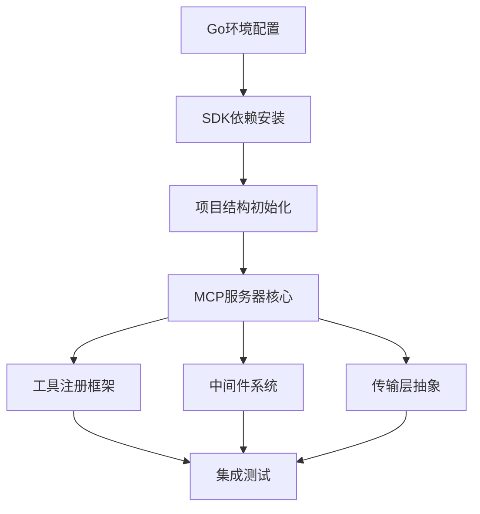

# MCP SDK 集成任务并行工作流分析

## 任务概述
**任务**: MCP SDK 集成设置  
**当前状态**: 开放  
**复杂度**: L (16-20 hours)  
**GitHub Issue**: [#2](https://github.com/ZephyrDeng/dev-context/issues/2)

## 依赖关系分析

### 核心依赖链

### 阻塞性依赖
1. **SDK安装** → 阻塞所有MCP相关开发
2. **服务器核心** → 阻塞工具注册、中间件、传输层
3. **项目结构** → 阻塞具体实现文件创建

## 并行工作流设计

### Stream 1: 基础设施 (关键路径)
**负责代理**: `infrastructure-agent`  
**优先级**: 最高  
**文件所有权**:
- `go.mod`, `go.sum`
- `cmd/server/main.go`
- `internal/mcp/server.go`

**任务序列**:
1. **S1.1**: Go环境验证和SDK依赖安装
   - 验证Go 1.21+环境
   - 添加`github.com/modelcontextprotocol/go-sdk`依赖
   - 初始化go.mod配置

2. **S1.2**: 项目目录结构初始化
   - 创建`cmd/server/`目录结构
   - 创建`internal/mcp/`目录结构
   - 创建`internal/middleware/`目录结构

3. **S1.3**: MCP服务器核心实现
   - 实现`internal/mcp/server.go`核心逻辑
   - 实现`cmd/server/main.go`启动入口
   - 基础配置管理系统

**输出**: 可运行的基础MCP服务器

### Stream 2: 工具注册系统 (依赖Stream 1.3)
**负责代理**: `tools-agent`  
**优先级**: 高  
**文件所有权**:
- `internal/mcp/tools.go`
- `internal/mcp/registry.go`
- `internal/mcp/metadata.go`

**任务序列**:
1. **S2.1**: 工具注册框架设计
   - 定义工具注册接口
   - 实现动态工具发现机制
   - 工具元数据管理系统

2. **S2.2**: 工具生命周期管理
   - 工具注册/注销机制
   - 工具状态监控
   - 工具依赖管理

**依赖**: 等待S1.3完成后启动  
**输出**: 完整的工具注册和管理系统

### Stream 3: 中间件系统 (依赖Stream 1.3)
**负责代理**: `middleware-agent`  
**优先级**: 中  
**文件所有权**:
- `internal/middleware/auth.go`
- `internal/middleware/logging.go`
- `internal/middleware/validation.go`
- `internal/middleware/error.go`

**任务序列**:
1. **S3.1**: 核心中间件接口设计
   - 定义中间件接口标准
   - 实现中间件链式调用机制
   - 中间件注册系统

2. **S3.2**: 基础中间件实现
   - 请求验证中间件
   - 日志记录中间件
   - 错误处理中间件
   - 认证授权中间件

**依赖**: 等待S1.3完成后启动  
**输出**: 完整的中间件支持系统

### Stream 4: 传输层抽象 (依赖Stream 1.3)
**负责代理**: `transport-agent`  
**优先级**: 中  
**文件所有权**:
- `internal/transport/stdio.go`
- `internal/transport/http.go`
- `internal/transport/websocket.go`
- `internal/transport/interface.go`

**任务序列**:
1. **S4.1**: 传输层接口设计
   - 定义统一的传输接口
   - 实现传输层抽象
   - 连接管理机制

2. **S4.2**: 多协议传输实现
   - stdio传输支持
   - HTTP传输支持
   - WebSocket传输支持
   - 传输层切换机制

**依赖**: 等待S1.3完成后启动  
**输出**: 多协议传输支持系统

### Stream 5: 测试和文档 (独立并行)
**负责代理**: `testing-agent`  
**优先级**: 中低  
**文件所有权**:
- `*_test.go`文件
- `docs/mcp-integration.md`
- `examples/`目录

**任务序列**:
1. **S5.1**: 测试框架准备
   - 单元测试框架设置
   - 集成测试环境准备
   - 测试工具配置

2. **S5.2**: 并行测试开发
   - 为每个完成的组件编写测试
   - 协议兼容性测试
   - 性能基准测试

3. **S5.3**: 文档编写
   - API文档生成
   - 集成指南编写
   - 示例代码创建

**依赖**: 可与其他Stream并行进行，逐步完善  
**输出**: 完整的测试覆盖和文档

## 并行执行策略

### 阶段1: 基础设施 (0-4小时)
- 仅执行Stream 1
- 确保核心MCP服务器可启动

### 阶段2: 并行开发 (4-16小时)
- Stream 2, 3, 4同时启动
- Stream 5持续进行
- Stream 1继续优化核心功能

### 阶段3: 集成和测试 (16-20小时)
- 所有Stream汇合
- 完整系统集成测试
- 文档完善和发布

## 文件冲突预防

### 文件所有权矩阵
| 文件路径 | 主要所有者 | 协作者 | 冲突风险 |
|---------|-----------|-------|---------|
| `go.mod` | infrastructure-agent | 所有 | 高 |
| `cmd/server/main.go` | infrastructure-agent | - | 低 |
| `internal/mcp/server.go` | infrastructure-agent | tools-agent | 中 |
| `internal/mcp/tools.go` | tools-agent | - | 低 |
| `internal/middleware/*` | middleware-agent | - | 低 |
| `internal/transport/*` | transport-agent | - | 低 |

### 冲突解决策略
1. **go.mod管理**: infrastructure-agent负责，其他agent通过PR提交依赖变更
2. **接口协调**: 定期同步会议，确保接口兼容性
3. **集成点**: 在server.go中预留扩展点，避免直接修改冲突

## 成功指标

### 技术指标
- [ ] MCP服务器成功启动并监听
- [ ] 支持3种传输协议
- [ ] 工具注册成功率100%
- [ ] 中间件正确拦截请求
- [ ] 单元测试覆盖率>80%

### 流程指标
- [ ] 4个并行Stream同时进行
- [ ] 无阻塞性文件冲突
- [ ] 预期16-20小时内完成
- [ ] 代码审查通过率100%

## 风险评估

### 高风险
- **SDK兼容性问题**: 官方SDK可能存在未知限制
- **并发文件冲突**: go.mod和server.go的修改冲突

### 中风险
- **接口设计变更**: 各组件接口可能需要调整
- **传输协议复杂性**: WebSocket实现可能超出预期

### 低风险
- **测试环境配置**: 标准Go测试环境
- **文档编写延期**: 不影响核心功能

## 建议执行顺序

1. **立即启动**: Stream 1 (infrastructure-agent)
2. **4小时后启动**: Stream 2, 3, 4并行执行
3. **持续进行**: Stream 5与其他所有Stream并行
4. **最后2小时**: 集成测试和文档完善

这个分析确保了最大化的并行执行效率，同时最小化了文件冲突风险和依赖阻塞。